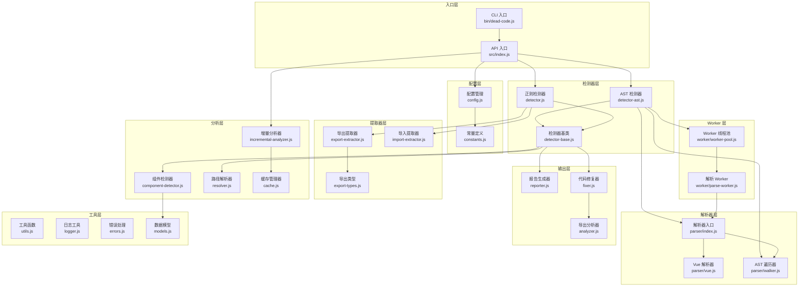

# Dead Code Detector 项目 Wiki

## 1. 项目概述

Dead Code Detector 是一个高效的死代码检测工具，专为 Vue 2/3 和 React 项目设计，帮助识别和清理未使用的代码、导出和组件。通过消除不再需要的代码，节省开发时间并减少打包体积。

### 主要功能

- **全面检测**：未使用的导出、组件和工具文件
- **多框架支持**：Vue 2/3（包括 `<script setup>`）、React、TypeScript、JSX/TSX
- **双重检测模式**：AST（准确）和正则表达式（兼容旧项目）
- **智能自动修复**：组导出部分移除、多行导出处理、错误恢复
- **配置灵活性**：支持 `.deadcoderc.json`、`.deadcoderc.js` 和 `deadcode.config.js`
- **路径别名支持**：自动检测并解析项目配置中的路径别名
- **测试文件感知**：跟踪测试文件中的导入，避免误报
- **LRU 缓存**：内存高效的缓存，具有自动淘汰机制（v1.1.0）
- **增量分析**：基于文件的缓存，通过优化依赖图实现更快的重新运行
- **备份系统**：在进行更改前自动创建备份
- **详细模式**：提供详细的进度和分析信息

## 2. 目录结构

```
├── bin/             # 命令行工具
│   └── dead-code.js # 主命令行入口
├── src/             # 源代码
│   ├── parser/      # AST 解析器模块
│   │   ├── index.js # 解析器入口
│   │   ├── vue.js   # Vue SFC 解析器
│   │   └── walker.js # AST 遍历工具
│   ├── worker/      # Worker 线程模块
│   │   ├── index.js # Worker 入口
│   │   ├── worker-pool.js # 线程池管理
│   │   └── parse-worker.js # 解析 Worker
│   ├── analyzer.js  # 导出分析工具
│   ├── cache.js     # 缓存管理器
│   ├── component-detector.js # 组件检测器
│   ├── config.js    # 配置加载与合并
│   ├── constants.js # 常量定义
│   ├── detector.js  # 正则模式检测器
│   ├── detector-ast.js # AST 模式检测器
│   ├── detector-base.js # 检测器基类
│   ├── error-handler.js # 错误处理
│   ├── errors.js    # 错误定义
│   ├── export-extractor.js # 导出提取器（正则）
│   ├── export-types.js # 导出类型判断
│   ├── fixer.js     # 代码修复工具
│   ├── import-extractor.js # 导入提取器（正则）
│   ├── incremental-analyzer.js # 增量分析器
│   ├── index.js     # 主入口，导出公共 API
│   ├── logger.js    # 日志工具
│   ├── models.js    # 数据模型
│   ├── reporter.js  # 报告生成器
│   ├── resolver.js  # 路径解析器
│   └── utils.js     # 工具函数
├── __tests__/       # 测试文件
├── docs/            # 文档
├── types/           # TypeScript 类型定义
├── API.md           # API 文档
├── CHANGELOG.md     # 变更日志
├── CONTRIBUTING.md  # 贡献指南
├── LICENSE          # 许可证
├── MIGRATION.md     # 迁移指南
├── README.md        # 项目说明
├── README.zh-CN.md  # 中文项目说明
├── TESTING.md       # 测试文档
├── jest.config.js   # Jest 配置
├── package-lock.json # NPM 锁文件
└── package.json     # 项目配置
```

## 3. 系统架构

Dead Code Detector 采用分层架构设计，支持两种检测模式：AST 模式（默认）和正则模式。系统由多个功能模块组成，每个模块负责特定的功能。

### 模块依赖关系



## 4. 核心模块

### 4.1 入口层

#### [index.js](file:///workspace/src/index.js)

主入口模块，提供两种使用方式：
- **API 方式**：`detect()` 函数，返回 Promise
- **CLI 方式**：`run()` 函数，直接运行分析

```javascript
// API 使用示例
const { detect } = require('@is_adou/dead-code-detector');
const result = await detect({ srcDir: './src', mode: 'ast' });
```

### 4.2 检测器层

#### [detector-base.js](file:///workspace/src/detector-base.js)

检测器基类，提供公共功能：

| 方法                                         | 说明                 |
| -------------------------------------------- | -------------------- |
| `scanFiles(dir)`                             | 扫描目录获取源文件   |
| `scanTestFiles()`                            | 扫描测试文件         |
| `countLocalUsage(file, name)`                | 计算本地使用次数     |
| `detectUnusedToolFiles()`                    | 检测未使用的工具文件 |
| `resolveImportPath(importPath, currentFile)` | 解析导入路径         |

#### [detector-ast.js](file:///workspace/src/detector-ast.js)

AST 模式检测器，继承自 `DeadCodeFinderBase`：
- 使用 Babel 解析器进行精确分析
- 支持 Worker 线程并行处理（大项目自动启用）
- 支持 Vue SFC、React JSX、TypeScript

#### [detector.js](file:///workspace/src/detector.js)

正则模式检测器，继承自 `DeadCodeFinderBase`：
- 使用正则表达式快速匹配
- 兼容旧版项目
- 适合简单项目快速扫描

### 4.3 解析器层

#### [parser/index.js](file:///workspace/src/parser/index.js)

解析器入口，根据文件扩展名选择解析方式：

```javascript
const { parse } = require('./parser');
const result = parse(content, filePath);
// result: { ast, success, error? }
```

#### [parser/walker.js](file:///workspace/src/parser/walker.js)

AST 遍历工具，提供以下遍历函数：

| 函数                  | 说明                    |
| --------------------- | ----------------------- |
| `walkExports(ast)`    | 遍历并收集所有导出      |
| `walkImports(ast)`    | 遍历并收集所有导入      |
| `walkJSX(ast)`        | 遍历并收集 JSX 组件使用 |
| `walkComponents(ast)` | 遍历并收集组件声明      |

#### [parser/vue.js](file:///workspace/src/parser/vue.js)

Vue 单文件组件解析器：
- 提取 `<script>` 和 `<script setup>` 内容
- 解析 Vue 组件元信息
- 识别 composables 和 exposed API

### 4.4 分析层

#### [resolver.js](file:///workspace/src/resolver.js)

路径解析器，负责解析各种路径别名：
- 支持相对路径（`./`, `../`）
- 支持路径别名（`@/`, `@@/`）
- 自动读取项目配置（tsconfig.json、vite.config.js 等）

#### [component-detector.js](file:///workspace/src/component-detector.js)

组件检测器，负责检测组件使用情况：
- 收集组件导入使用情况
- 构建组件标签索引（PascalCase 和 kebab-case）
- 检测未使用的组件

#### [incremental-analyzer.js](file:///workspace/src/incremental-analyzer.js)

增量分析器，支持基于 Git 变更的分析：
- 获取 Git 变更文件列表
- 分析受影响的依赖文件
- 过滤分析结果

### 4.5 输出层

#### [reporter.js](file:///workspace/src/reporter.js)

报告生成器，生成分析报告：
- 按文件分组显示结果
- 显示统计信息和摘要
- 支持进度显示

#### [fixer.js](file:///workspace/src/fixer.js)

代码修复工具，自动删除未使用代码：
- 创建备份目录
- 按文件修复未使用导出
- 删除未使用的工具文件

### 4.6 Worker 层

#### [worker/worker-pool.js](file:///workspace/src/worker/worker-pool.js)

Worker 线程池管理：
- 自动根据 CPU 核心数创建 Worker
- 任务队列管理
- 超时处理和错误恢复

## 5. 关键类与函数

### 5.1 核心类

#### `DeadCodeFinderBase`

**位置**: [src/detector-base.js](file:///workspace/src/detector-base.js)

**功能**: 检测器基类，提供文件扫描、导入解析、使用计数等通用功能

**主要方法**:
- `scanFiles(dir, options)`: 扫描目录获取源文件
- `scanTestFiles()`: 扫描测试文件并收集导入
- `countLocalUsage(file, name)`: 计算文件中名称的本地使用次数
- `detectUnusedToolFiles()`: 检测未使用的工具文件
- `resolveImportPath(importPath, currentFile)`: 解析导入路径

#### `DeadCodeFinderAST`

**位置**: [src/detector-ast.js](file:///workspace/src/detector-ast.js)

**功能**: AST 模式检测器，使用 Babel 解析器进行精确分析

**主要方法**:
- `analyze()`: 运行完整分析
- `report()`: 生成并打印报告
- `fix(options)`: 自动修复未使用的代码

#### `DeadCodeFinder`

**位置**: [src/detector.js](file:///workspace/src/detector.js)

**功能**: 正则模式检测器，使用正则表达式快速匹配

**主要方法**:
- `analyze()`: 运行完整分析
- `report()`: 生成并打印报告
- `fix(options)`: 自动修复未使用的代码

#### `PathResolver`

**位置**: [src/resolver.js](file:///workspace/src/resolver.js)

**功能**: 路径解析器，负责解析各种路径别名

**主要方法**:
- `resolve(importPath, currentFile)`: 解析导入路径
- `resolveAlias(importPath)`: 解析路径别名

#### `ComponentDetector`

**位置**: [src/component-detector.js](file:///workspace/src/component-detector.js)

**功能**: 组件检测器，负责检测组件使用情况

**主要方法**:
- `collectComponents(components)`: 收集组件信息
- `detectUnusedComponents(imports, exports)`: 检测未使用的组件

### 5.2 核心函数

#### `detect(options)`

**位置**: [src/index.js](file:///workspace/src/index.js)

**功能**: 运行死代码检测

**参数**:
- `options`: 配置选项
  - `srcDir`: 源代码目录 (默认: ./src)
  - `extensions`: 文件扩展名
  - `ignoreDirs`: 忽略的目录
  - `verbose`: 详细日志
  - `mode`: 检测模式: 'ast' (默认) 或 'regex'
  - `config`: 配置文件路径
  - `maxFileSize`: 最大文件大小（字节）
  - `concurrency`: 最大并发数

**返回值**: Promise<Object> 分析结果

#### `run()`

**位置**: [src/index.js](file:///workspace/src/index.js)

**功能**: 命令行运行器

**使用方式**:
```bash
dead-code [选项]
```

#### `parse(content, filePath)`

**位置**: [src/parser/index.js](file:///workspace/src/parser/index.js)

**功能**: 解析文件内容，生成 AST

**参数**:
- `content`: 文件内容
- `filePath`: 文件路径

**返回值**: { ast, success, error? }

## 6. 依赖关系

| 依赖项 | 版本 | 用途 | 位置 |
|--------|------|------|------|
| @babel/parser | ^7.24.0 | 解析 JavaScript/TypeScript 代码生成 AST | [package.json](file:///workspace/package.json) |
| @babel/preset-env | ^7.24.0 | Babel 预设，用于支持现代 JavaScript | [package.json](file:///workspace/package.json) |
| @babel/preset-react | ^7.24.0 | Babel 预设，用于支持 React JSX | [package.json](file:///workspace/package.json) |
| @babel/preset-typescript | ^7.24.0 | Babel 预设，用于支持 TypeScript | [package.json](file:///workspace/package.json) |
| @babel/traverse | ^7.24.0 | 遍历和操作 AST | [package.json](file:///workspace/package.json) |

## 7. 项目运行方式

### 7.1 安装

```bash
# 全局安装（推荐）
npm install -g @is_adou/dead-code-detector

# 本地安装
npm install @is_adou/dead-code-detector --save-dev

# 使用 npx
npx dead-code

# 或添加到 package.json 脚本
# {
#   "scripts": {
#     "dead-code": "dead-code"
#   }
# }
npm run dead-code
```

### 7.2 基本使用

```bash
# 基本检测
dead-code

# 指定目录和模式
dead-code --src ./src --mode ast

# 自动修复并预览
dead-code --fix --dry-run

# 自动修复并确认
dead-code --fix --confirm
```

### 7.3 增量分析

```bash
# 增量分析（自动检测主分支）
dead-code --incremental

# 指定基准分支
dead-code --incremental --base-branch develop
```

### 7.4 高级使用

```bash
# 按扩展名过滤
dead-code --ext .js,.ts,.tsx

# 忽略目录
dead-code --ignore node_modules,dist,.git,coverage

# 详细输出
dead-code --verbose

# 自定义源目录
dead-code --src ./src/components

# 组合选项
dead-code --src ./src --mode ast --ext .js,.vue,.tsx --ignore node_modules,dist --verbose
```

## 8. 配置说明

### 8.1 配置文件

创建 `.deadcoderc.json` 在项目根目录：

```json
{
  "srcDir": "./src",
  "extensions": [".js", ".vue", ".jsx", ".ts", ".tsx"],
  "ignoreDirs": ["node_modules", "dist", ".git"],
  "mode": "ast",
  "cache": true,
  "cacheDir": ".dead-code-cache"
}
```

### 8.2 完整配置选项

| 选项 | 描述 | 默认值 |
|------|------|--------|
| `srcDir` | 要扫描的源目录 | `./src` |
| `extensions` | 要包含的文件扩展名 | `[".js", ".vue", ".jsx", ".ts", ".tsx"]` |
| `ignoreDirs` | 要忽略的目录 | `["node_modules", "dist", ".git"]` |
| `mode` | 检测模式: "ast" 或 "regex" | `"ast"` |
| `fix` | 启用自动修复模式 | `false` |
| `verbose` | 启用详细输出 | `false` |
| `maxFileSize` | 最大文件大小（字节） | `1000000` (1MB) |
| `concurrency` | 最大并发数 | `50` |
| `cache` | 启用持久缓存 | `true` |
| `cacheDir` | 缓存目录 | `.dead-code-cache` |
| `cacheMaxAge` | 缓存最大年龄（毫秒） | `604800000` (7 天) |
| `maxEntries` | 最大缓存条目 | `100` |
| `maxMemoryMB` | 缓存最大内存 | `50` |

## 9. 扩展指南

### 9.1 添加新的检测器

1. **创建检测器类**：在 `src/` 目录下创建新的检测器文件
2. **集成到检测器基类**：在 `detector-base.js` 中添加引用和方法
3. **在分析流程中调用**：在 `detector-ast.js` 或 `detector.js` 的 `analyze()` 方法中调用

### 9.2 添加新的解析器

1. **创建解析器模块**：在 `src/parser/` 目录下创建新文件
2. **更新解析器入口**：在 `parser/index.js` 中添加新扩展名支持
3. **添加 AST 遍历规则**：在 `parser/walker.js` 中添加新的遍历函数

### 9.3 插件系统

项目支持通过配置文件扩展功能：

```json
// .deadcoderc.json
{
  "srcDir": "./src",
  "extensions": [".js", ".vue", ".jsx", ".ts", ".tsx"],
  "ignoreDirs": ["node_modules", "dist", ".git"],
  "mode": "ast",

  // 自定义配置
  "customDetectors": ["./detectors/i18n-detector.js", "./detectors/router-detector.js"],
  "customParsers": {
    ".svelte": "./parsers/svelte-parser.js"
  },
  "ignoreExports": ["customIgnore1", "customIgnore2"],
  "hooks": {
    "beforeAnalyze": "./hooks/before-analyze.js",
    "afterAnalyze": "./hooks/after-analyze.js",
    "beforeFix": "./hooks/before-fix.js"
  }
}
```

## 10. 最佳实践

### 10.1 大型项目优化

1. **启用 Worker 线程**：文件数超过 500 时自动启用
2. **使用增量分析**：只分析变更文件
3. **调整并发数**：根据机器配置调整 `concurrency` 参数

### 10.2 配置示例

```json
{
  "mode": "ast",
  "concurrency": 100,
  "maxFileSize": 2000000,
  "incremental": true,
  "base-branch": "main"
}
```

### 10.3 安全使用自动修复

1. 始终先运行不带 `--fix` 的命令预览结果
2. 使用 `--dry-run` 查看会被删除的内容
3. 使用 `--confirm` 进行交互式确认
4. 检查 `backup/` 目录（如有需要）

## 11. 故障排除

### 11.1 常见问题

**Q: 为什么某些导出未被检测到？**
可能原因：动态导入、作为副作用导入、在测试文件中使用、或路径别名解析失败。

**Q: 为什么组件被标记为未使用？**
可能原因：不同的命名约定（PascalCase vs kebab-case）、在模板中使用但未在脚本中导入、或全局注册。

**Q: 如果自动修复删除了错误的代码怎么办？**
从 `backup/` 目录恢复。该工具在进行更改前会自动创建备份。

**Q: 对于大型项目，检测速度慢？**
1. 使用 AST 模式（默认）- 对于大型项目更快
2. 使用 `--ignore` 将大型目录添加到忽略列表
3. 使用 `--ext` 限制文件扩展名

### 11.2 错误消息

| 错误 | 解决方案 |
|------|----------|
| "Cannot parse file" | 文件有语法错误，将被跳过 |
| "Path alias not resolved" | 检查项目配置或手动指定 |
| "No files found" | 使用 `--src` 检查源目录 |

## 12. 相关文档

- [API 文档](file:///workspace/API.md)
- [贡献指南](file:///workspace/CONTRIBUTING.md)
- [测试文档](file:///workspace/TESTING.md)
- [架构设计文档](file:///workspace/docs/ARCHITECTURE.md)

## 13. 许可证

MIT License - 详见 [LICENSE](file:///workspace/LICENSE) 文件。

## 14. 鸣谢

- 使用 Babel 进行 AST 解析
- 受各种死代码检测工具启发

---

**愉快编码！** 🎉