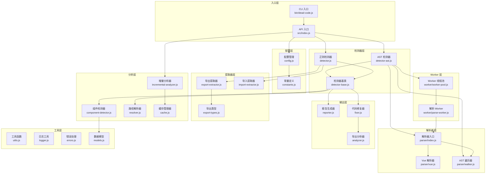
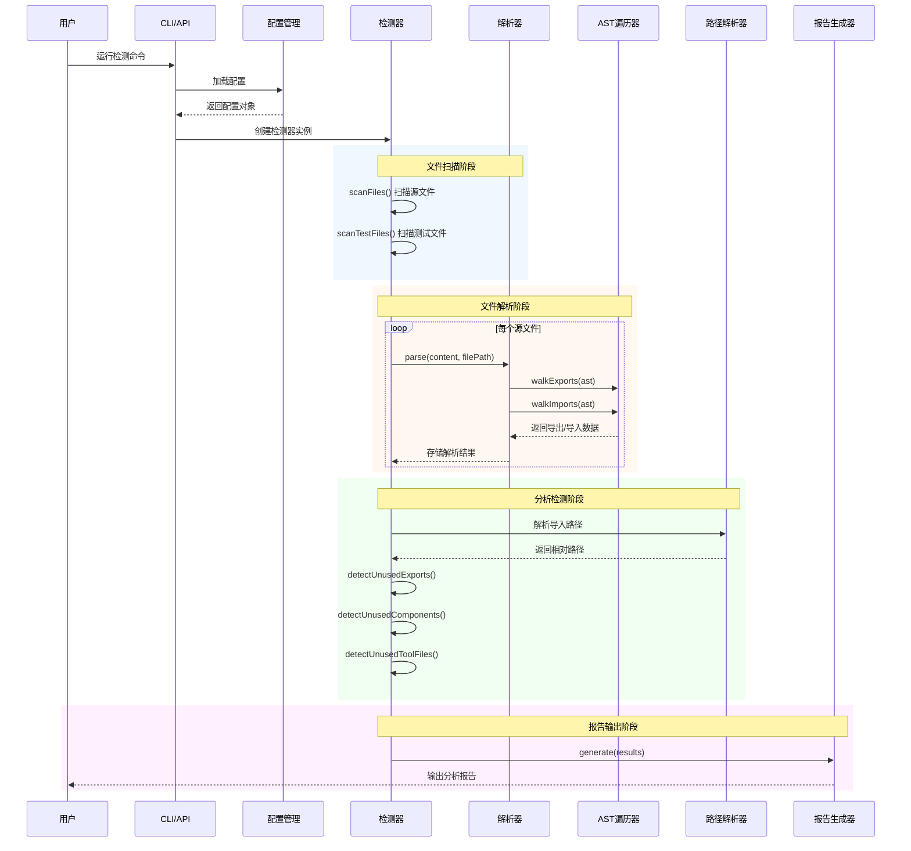
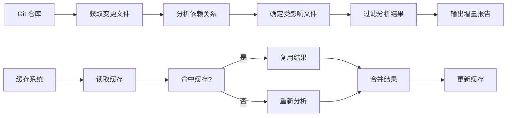

# 架构设计文档

本文档描述死代码检测器的系统架构、模块依赖关系、数据流和扩展指南。

## 目录

- [系统概述](#系统概述)
- [模块依赖关系图](#模块依赖关系图)
- [核心模块说明](#核心模块说明)
- [数据流说明](#数据流说明)
- [扩展指南](#扩展指南)

---

## 系统概述

死代码检测器是一个用于检测 JavaScript/TypeScript/Vue/React 项目中未使用代码的工具。系统采用分层架构设计，支持两种检测模式：

- **AST 模式**（默认）：使用 Babel 解析器进行精确的语法分析
- **正则模式**：使用正则表达式进行快速匹配（兼容旧版）

### 主要功能

1. 检测未使用的导出（exports）
2. 检测未使用的组件（Vue/React 组件）
3. 检测未使用的工具文件
4. 支持增量分析（基于 Git 变更）
5. 支持自动修复（删除未使用代码）

---

## 模块依赖关系图

### 整体架构图



### 模块层次结构

```
src/
├── index.js              # 主入口，导出公共 API
├── detector.js           # 正则模式检测器
├── detector-ast.js       # AST 模式检测器
├── detector-base.js      # 检测器基类
├── config.js             # 配置加载与合并
├── constants.js          # 常量定义
├── reporter.js           # 报告生成器
├── fixer.js              # 代码修复工具
├── analyzer.js           # 导出分析工具
├── resolver.js           # 路径解析器
├── component-detector.js # 组件检测器
├── incremental-analyzer.js # 增量分析器
├── cache.js              # 缓存管理器
├── export-extractor.js   # 导出提取器（正则）
├── import-extractor.js   # 导入提取器（正则）
├── export-types.js       # 导出类型判断
├── models.js             # 数据模型
├── utils.js              # 工具函数
├── logger.js             # 日志工具
├── errors.js             # 错误处理
├── parser/               # AST 解析器模块
│   ├── index.js          # 解析器入口
│   ├── vue.js            # Vue SFC 解析器
│   └── walker.js         # AST 遍历工具
└── worker/               # Worker 线程模块
    ├── index.js          # Worker 入口
    ├── worker-pool.js    # 线程池管理
    └── parse-worker.js   # 解析 Worker
```

---

## 核心模块说明

### 1. 入口层

#### [index.js](../src/index.js)

主入口模块，提供两种使用方式：

- **API 方式**：`detect()` 函数，返回 Promise
- **CLI 方式**：`run()` 函数，直接运行分析

```javascript
// API 使用示例
const { detect } = require('@is_adou/dead-code-detector');
const result = await detect({ srcDir: './src', mode: 'ast' });
```

### 2. 检测器层

#### [detector-base.js](../src/detector-base.js)

检测器基类，提供公共功能：

| 方法                                         | 说明                 |
| -------------------------------------------- | -------------------- |
| `scanFiles(dir)`                             | 扫描目录获取源文件   |
| `scanTestFiles()`                            | 扫描测试文件         |
| `countLocalUsage(file, name)`                | 计算本地使用次数     |
| `detectUnusedToolFiles()`                    | 检测未使用的工具文件 |
| `resolveImportPath(importPath, currentFile)` | 解析导入路径         |

#### [detector-ast.js](../src/detector-ast.js)

AST 模式检测器，继承自 `DeadCodeFinderBase`：

- 使用 Babel 解析器进行精确分析
- 支持 Worker 线程并行处理（大项目自动启用）
- 支持 Vue SFC、React JSX、TypeScript

#### [detector.js](../src/detector.js)

正则模式检测器，继承自 `DeadCodeFinderBase`：

- 使用正则表达式快速匹配
- 兼容旧版项目
- 适合简单项目快速扫描

### 3. 解析器层

#### [parser/index.js](../src/parser/index.js)

解析器入口，根据文件扩展名选择解析方式：

```javascript
const { parse } = require('./parser');
const result = parse(content, filePath);
// result: { ast, success, error? }
```

#### [parser/walker.js](../src/parser/walker.js)

AST 遍历工具，提供以下遍历函数：

| 函数                  | 说明                    |
| --------------------- | ----------------------- |
| `walkExports(ast)`    | 遍历并收集所有导出      |
| `walkImports(ast)`    | 遍历并收集所有导入      |
| `walkJSX(ast)`        | 遍历并收集 JSX 组件使用 |
| `walkComponents(ast)` | 遍历并收集组件声明      |

#### [parser/vue.js](../src/parser/vue.js)

Vue 单文件组件解析器：

- 提取 `<script>` 和 `<script setup>` 内容
- 解析 Vue 组件元信息
- 识别 composables 和 exposed API

### 4. 分析层

#### [resolver.js](../src/resolver.js)

路径解析器，负责解析各种路径别名：

- 支持相对路径（`./`, `../`）
- 支持路径别名（`@/`, `@@/`）
- 自动读取项目配置（tsconfig.json、vite.config.js 等）

#### [component-detector.js](../src/component-detector.js)

组件检测器，负责检测组件使用情况：

- 收集组件导入使用情况
- 构建组件标签索引（PascalCase 和 kebab-case）
- 检测未使用的组件

#### [incremental-analyzer.js](../src/incremental-analyzer.js)

增量分析器，支持基于 Git 变更的分析：

- 获取 Git 变更文件列表
- 分析受影响的依赖文件
- 过滤分析结果

### 5. 输出层

#### [reporter.js](../src/reporter.js)

报告生成器，生成分析报告：

- 按文件分组显示结果
- 显示统计信息和摘要
- 支持进度显示

#### [fixer.js](../src/fixer.js)

代码修复工具，自动删除未使用代码：

- 创建备份目录
- 按文件修复未使用导出
- 删除未使用的工具文件

### 6. Worker 层

#### [worker/worker-pool.js](../src/worker/worker-pool.js)

Worker 线程池管理：

- 自动根据 CPU 核心数创建 Worker
- 任务队列管理
- 超时处理和错误恢复

---

## 数据流说明

### 完整分析流程



### 数据转换流程

```
┌─────────────────────────────────────────────────────────────────┐
│                        输入：源代码文件                           │
└─────────────────────────────────────────────────────────────────┘
                                │
                                ▼
┌─────────────────────────────────────────────────────────────────┐
│  阶段 1：文件扫描                                                 │
│  ─────────────────────────────────────────────────────────────  │
│  输入：源代码目录路径                                             │
│  输出：文件路径列表 [filePath1, filePath2, ...]                  │
│  处理：递归扫描目录，过滤扩展名，排除忽略目录                       │
└─────────────────────────────────────────────────────────────────┘
                                │
                                ▼
┌─────────────────────────────────────────────────────────────────┐
│  阶段 2：文件解析                                                 │
│  ─────────────────────────────────────────────────────────────  │
│  输入：文件路径列表                                               │
│  输出：解析结果 Map {                                            │
│    exports: Map<filePath, ExportItem[]>                         │
│    imports: Map<filePath, ImportItem[]>                         │
│    components: Map<filePath, ComponentItem>                     │
│    jsxUsage: Map<filePath, string[]>                            │
│  }                                                              │
│  处理：读取文件内容 → 解析 AST → 遍历提取信息                      │
└─────────────────────────────────────────────────────────────────┘
                                │
                                ▼
┌─────────────────────────────────────────────────────────────────┐
│  阶段 3：路径解析                                                 │
│  ─────────────────────────────────────────────────────────────  │
│  输入：导入路径（可能包含别名）                                    │
│  输出：相对路径（标准化后）                                       │
│  处理：识别路径类型 → 解析别名 → 查找实际文件                      │
└─────────────────────────────────────────────────────────────────┘
                                │
                                ▼
┌─────────────────────────────────────────────────────────────────┐
│  阶段 4：使用情况分析                                             │
│  ─────────────────────────────────────────────────────────────  │
│  输入：exports Map, imports Map                                  │
│  输出：未使用项列表                                               │
│  处理：                                                          │
│  1. 构建导入索引 Map<name, Set<usedInFiles>>                    │
│  2. 遍历导出，检查是否在导入索引中                                │
│  3. 检查本地使用情况                                             │
│  4. 过滤框架 API 和忽略列表                                      │
└─────────────────────────────────────────────────────────────────┘
                                │
                                ▼
┌─────────────────────────────────────────────────────────────────┐
│  阶段 5：报告生成                                                 │
│  ─────────────────────────────────────────────────────────────  │
│  输入：未使用项列表                                               │
│  输出：格式化报告                                                 │
│  处理：按文件分组 → 排序 → 格式化输出                             │
└─────────────────────────────────────────────────────────────────┘
                                │
                                ▼
┌─────────────────────────────────────────────────────────────────┐
│                      输出：分析报告                               │
│  ─────────────────────────────────────────────────────────────  │
│  - 未使用的导出列表                                              │
│  - 未使用的组件列表                                              │
│  - 未使用的工具文件列表                                          │
│  - 统计摘要                                                      │
└─────────────────────────────────────────────────────────────────┘
```

### 增量分析数据流



---

## 扩展指南

### 添加新的检测器

检测器用于检测特定类型的死代码。要添加新的检测器：

#### 1. 创建检测器类

在 `src/` 目录下创建新的检测器文件：

```javascript
// src/custom-detector.js
class CustomDetector {
  constructor(options = {}) {
    this.options = options;
  }

  /**
   * 执行检测
   * @param {Map} exports - 导出映射
   * @param {Map} imports - 导入映射
   * @param {Map} components - 组件映射
   * @returns {Array} 检测结果
   */
  detect(exports, imports, components) {
    const results = [];

    // 实现检测逻辑
    for (const [file, fileExports] of exports) {
      // 自定义检测规则
    }

    return results;
  }
}

module.exports = { CustomDetector };
```

#### 2. 集成到检测器基类

在 [detector-base.js](../src/detector-base.js) 中添加：

```javascript
const { CustomDetector } = require('./custom-detector');

class DeadCodeFinderBase {
  constructor(options = {}) {
    // ... 现有代码

    // 添加自定义检测器
    this.customDetector = new CustomDetector(options);
  }

  // 添加检测方法
  detectCustomIssues() {
    return this.customDetector.detect(this.exports, this.imports, this.components);
  }
}
```

#### 3. 在分析流程中调用

在 [detector-ast.js](../src/detector-ast.js) 或 [detector.js](../src/detector.js) 的 `analyze()` 方法中：

```javascript
async analyze() {
  // ... 现有分析代码

  // 添加自定义检测
  Reporter.printDetectionStage('自定义检测');
  this.customResults = this.detectCustomIssues();

  return {
    unusedExports: this.unusedExports,
    unusedComponents: this.unusedComponents,
    unusedToolFiles: this.unusedToolFiles,
    customResults: this.customResults, // 新增结果
  };
}
```

### 添加新的解析器

解析器用于解析特定文件类型或语法。要添加新的解析器：

#### 1. 创建解析器模块

在 `src/parser/` 目录下创建新文件：

```javascript
// src/parser/custom-parser.js
const { parse: babelParse } = require('@babel/parser');

/**
 * 解析自定义文件类型
 * @param {string} content - 文件内容
 * @param {string} filePath - 文件路径
 * @returns {Object} 解析结果
 */
function parseCustom(content, filePath) {
  try {
    // 预处理内容（如果需要）
    const processedContent = preprocessContent(content);

    // 使用 Babel 解析
    const ast = babelParse(processedContent, {
      sourceType: 'module',
      plugins: [
        // 添加必要的插件
      ],
    });

    return {
      ast,
      success: true,
      customInfo: extractCustomInfo(ast), // 提取自定义信息
    };
  } catch (error) {
    return {
      ast: null,
      success: false,
      error: error.message,
    };
  }
}

/**
 * 预处理内容
 */
function preprocessContent(content) {
  // 实现预处理逻辑
  return content;
}

/**
 * 提取自定义信息
 */
function extractCustomInfo(ast) {
  // 实现信息提取逻辑
  return {};
}

module.exports = {
  parseCustom,
  preprocessContent,
  extractCustomInfo,
};
```

#### 2. 更新解析器入口

在 [parser/index.js](../src/parser/index.js) 中添加：

```javascript
const { parseCustom } = require('./custom-parser');

function parse(content, filePath) {
  const ext = path.extname(filePath).toLowerCase();

  // 添加新扩展名支持
  if (ext === '.custom') {
    return parseCustom(content, filePath);
  }

  // ... 现有代码
}
```

#### 3. 添加 AST 遍历规则

如果需要新的遍历规则，在 [parser/walker.js](../src/parser/walker.js) 中添加：

```javascript
/**
 * 遍历 AST 并收集自定义信息
 * @param {Object} ast - AST
 * @returns {Object} 收集的信息
 */
function walkCustom(ast) {
  const customItems = [];

  const visitor = {
    // 添加访问者方法
    CustomNodeType(path) {
      const node = path.node;
      customItems.push({
        name: node.name,
        type: 'custom',
        line: node.loc?.start.line || 0,
      });
    },
  };

  traverse(ast, visitor);
  return customItems;
}

module.exports = {
  // ... 现有导出
  walkCustom,
};
```

### 插件系统设计

项目支持通过配置文件扩展功能：

#### 配置文件示例

```json
// .deadcoderc.json
{
  "srcDir": "./src",
  "extensions": [".js", ".vue", ".jsx", ".ts", ".tsx"],
  "ignoreDirs": ["node_modules", "dist", ".git"],
  "mode": "ast",

  // 自定义配置
  "customDetectors": ["./detectors/i18n-detector.js", "./detectors/router-detector.js"],
  "customParsers": {
    ".svelte": "./parsers/svelte-parser.js"
  },
  "ignoreExports": ["customIgnore1", "customIgnore2"],
  "hooks": {
    "beforeAnalyze": "./hooks/before-analyze.js",
    "afterAnalyze": "./hooks/after-analyze.js",
    "beforeFix": "./hooks/before-fix.js"
  }
}
```

#### 自定义检测器插件

```javascript
// detectors/i18n-detector.js
module.exports = {
  name: 'i18n-detector',

  /**
   * 检测未使用的 i18n 翻译键
   * @param {Object} context - 检测上下文
   * @returns {Array} 检测结果
   */
  detect(context) {
    const { exports, imports, fileContents } = context;
    const unusedKeys = [];

    // 实现检测逻辑

    return unusedKeys;
  },
};
```

#### 钩子函数

```javascript
// hooks/before-analyze.js
module.exports = function (context) {
  console.log('开始分析，文件数量:', context.fileCount);

  // 可以修改配置
  context.config.customOption = 'value';

  // 返回修改后的上下文
  return context;
};
```

### 扩展常量和忽略列表

在 [constants.js](../src/constants.js) 中添加：

```javascript
// 添加到 IGNORE_EXPORTS 集合
IGNORE_EXPORTS.add('myCustomExport');

// 添加新的常量
const CUSTOM_PATTERNS = {
  MY_PATTERN: /my-custom-pattern/g,
};

module.exports = {
  // ... 现有导出
  CUSTOM_PATTERNS,
};
```

---

## 性能优化建议

### 大型项目优化

1. **启用 Worker 线程**：文件数超过 500 时自动启用
2. **使用增量分析**：只分析变更文件
3. **调整并发数**：根据机器配置调整 `concurrency` 参数

### 配置示例

```json
{
  "mode": "ast",
  "concurrency": 100,
  "maxFileSize": 2000000,
  "incremental": true,
  "base-branch": "main"
}
```

---

## 相关文档

- [API 文档](../API.md)
- [贡献指南](../CONTRIBUTING.md)
- [测试文档](../TESTING.md)
